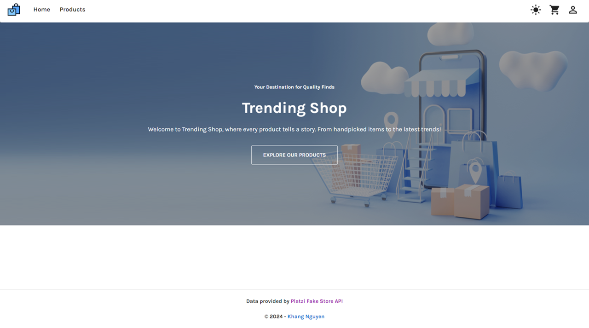
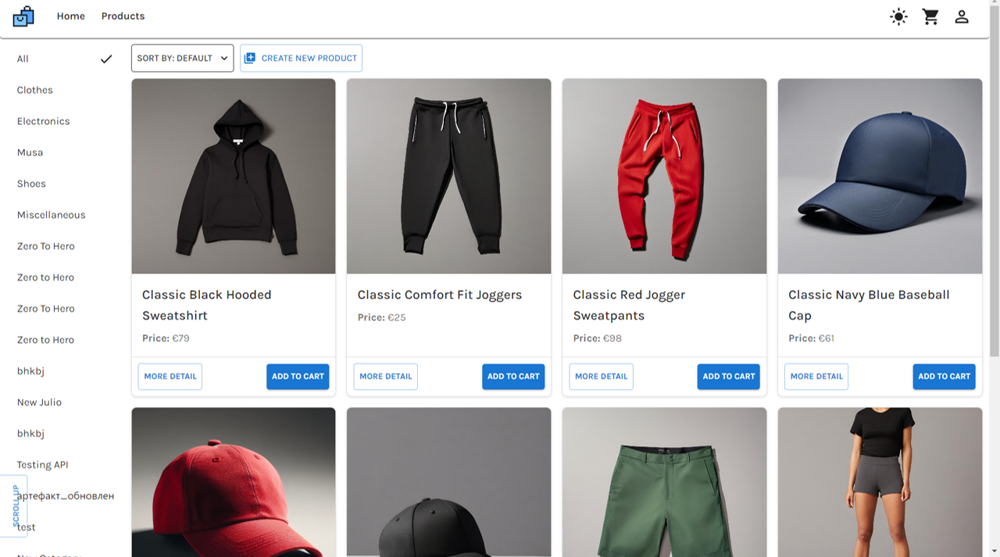
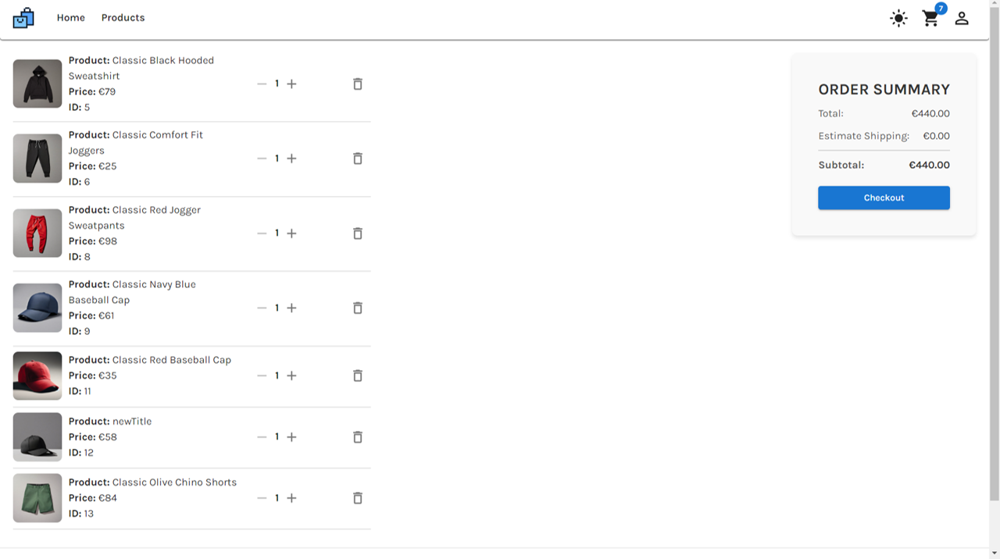
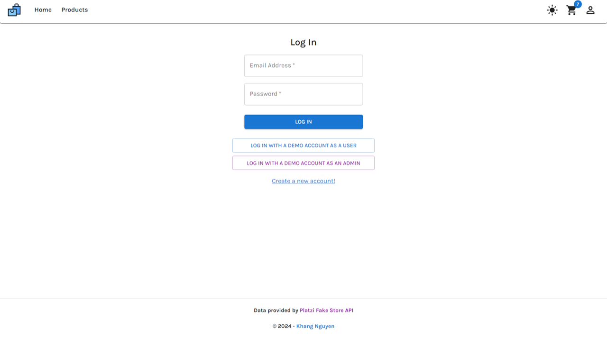
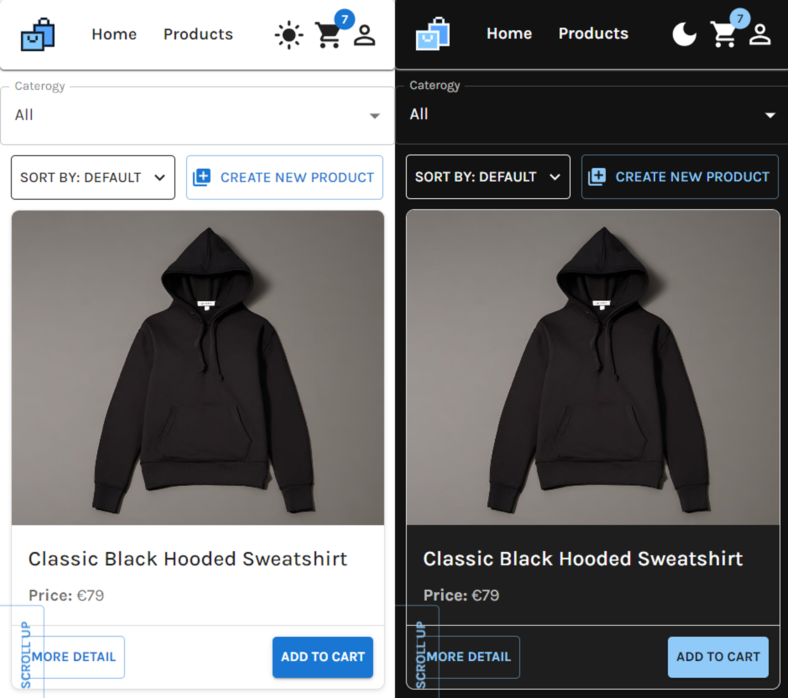

# E-Commerce Website

The E-Commerce Website is a web application built with React that provides users with an online shopping experience. It fetches product data from [Platzi Fake Store API](https://fakeapi.platzi.com/) and offers features such as browsing products, adding items to the cart, and managing products.

## Features

- **Browse Products:** Explore a diverse selection of products sourced from [Platzi Fake Store API](https://fakeapi.platzi.com/).
- **Product Details:** Access comprehensive information about each product, including name, price, description, and image.
- **Shopping Cart Management:** Add products to the shopping cart and easily manage cart items.
- **User Authentication:** Securely login and register accounts to access personalized features.
- **Demo Account:** Quickly explore the website's features without registering by logging in with a demo account.
- **Light-Dark Mode:** Customize users' browsing experience with the option to switch between light and dark themes.
- **Toast Notifications:** Receive instant feedback on actions or the status of operations through toast notifications.
- **Responsive Design:** Enjoy a seamless shopping experience across various devices with a responsive website design.

## Demo

- Check out the [Live Demo](https://trending-shop.netlify.app/) to experience the E-Commerce Website in action.

## Technologies Used

- TypeScript
- Redux Toolkit
- React
- CSS
- Material UI

## Installation and Usage

1. Clone the repository: `git clone https://github.com/Kudoo39/trending-shop`
2. Navigate to the project directory: `cd trending-shop`
3. Install dependencies: `yarn install`
4. Run the app locally: `yarn start`

## Screenshots

Here are some screenshots of the E-Commerce Website:

Homepage:

Products Page:

Cart Page:

Login Page:

Responsive Design:

